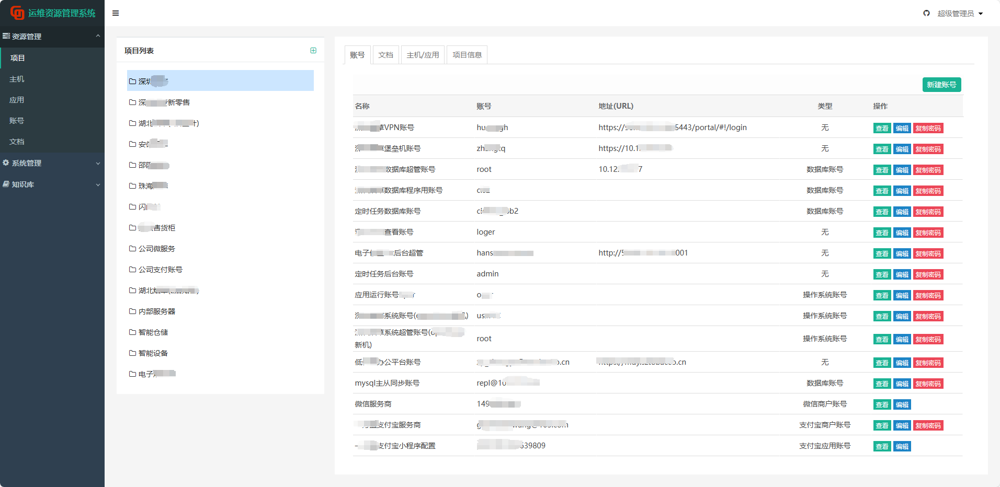
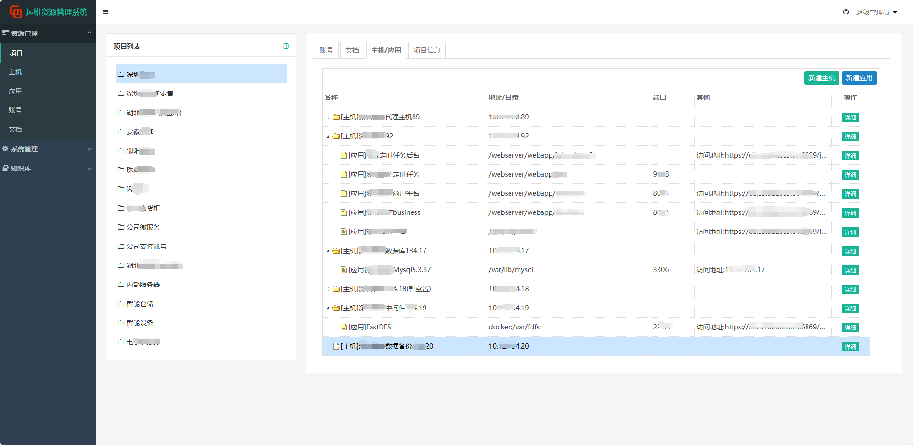
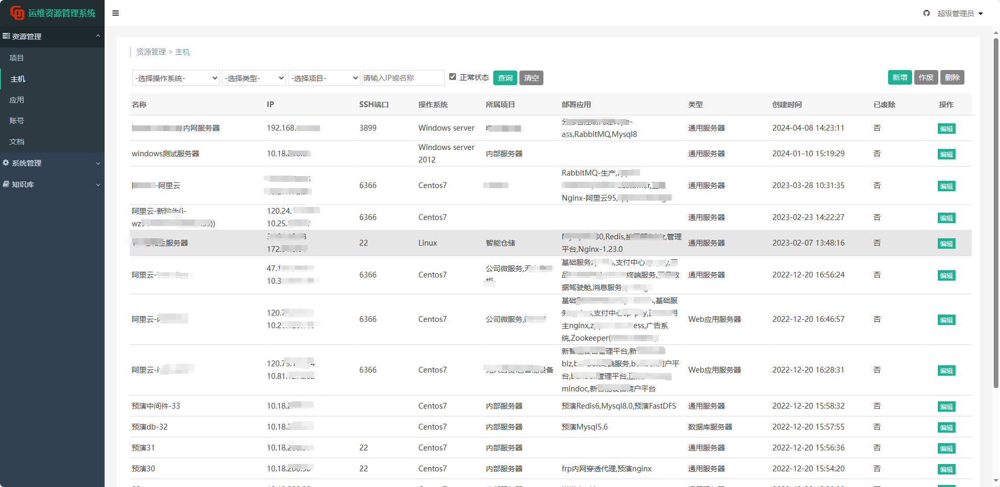
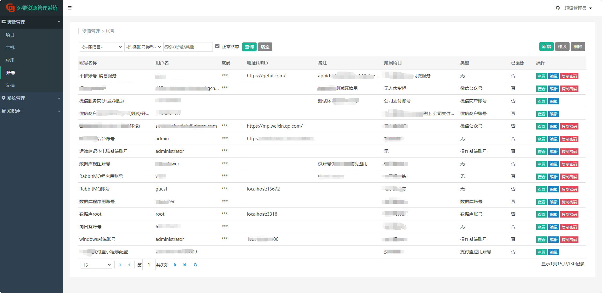
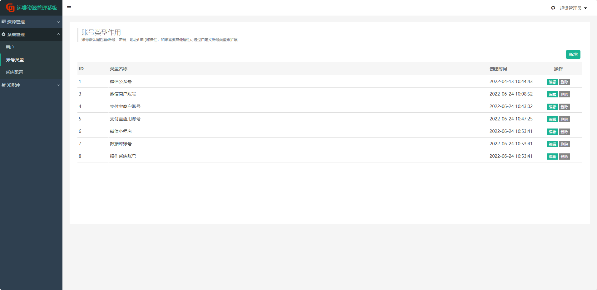

GO-OAM是基于go语言开发的web版运维资源管理系统,算是简版的CMDB,将各种难记的**账号、密码、主机、文档、应用**等资源管理起来,以项目方式整合.

通过自定义账号类型账号可以增加动态属性,默认初始了微信/支付宝商户账号、微信公众号、小程序、数据库账号等类型.

## 系统截图











## 技术选型:

* 后端：golang1.8+, beego
* 前端：jquery, easyui,tui-editor
* 数据库:mysql5.7+ 或 sqlite3+

## 安装部署

可选择下载编译好的安装包(推荐)或自行编译打包, 使用已编译好的包请从第三步开始

### 编译打包

项目根目录下提供了一个打包脚本: build.bat, 脚本默认目标平台是linux. 如要打包windows加参数w,即: build.bat w

如果熟悉beego也可自定义打包命令,各平台打包命令如下(命令参数请参考beego):

**linux环境:**

```
bee pack -exp=screenshot:logs:.vscode:.git:README.md:tests:build.bat:oam.zip:oam.tar.gz:Dockerfile:conf/pri.pem:conf/pub.pem -a=oam -be GOOS=linux -be GOARCH=amd64
```

编译后文件在源码要目录下:oam.tar.gz

**windows环境:**

```
bee pack -f=zip -exp=screenshot:logs:.vscode:.git:README.md:tests:build.bat:oam.zip:oam.tar.gz:Dockerfile:conf/pri.pem:conf/pub.pem:start.sh -a=oam -be GOOS=windows -be GOARCH=amd64
```

编译后文件在源码根目录下: oam.zip

  
**使用sqlite数据库时**,由于使用的是go-sqlite3驱动,该驱动使用了gcc(操作系统需安装相关库)需要开启CGO_ENABLED才能编译成功,如下:
 ```
  go env -w CGO_ENABLED=1
 ```

>开启此项不能跨平台交叉编译了, 如要编译为Linux程序,需要在Linux环境下打包

### 配置

1. 解压安装包
   
启动文件是根目录下的oam文件(windows为oam.exe).

2. 修改配置

配置文件conf/app.conf主要配置项说明:

```
httpport = 8848  # 端口号
runmode = prod    # 当前使用环境,对应下面的[dev/prod]章节名称
...
dbtype=mysql     # 使用的数据库类型:mysql 或sqlite
dbname = "oam"   # 数据库名称
...

#下面是不同环境的配置变量,主要是数据库信息,其他可以不动
[dev]
debug = "true"
dbuser = "user"
dbpasswd = "123"
dbaddr = "10.18.203.94"
store_path=

[prod]
debug = "false"
dbuser = "数据库用户名"
dbpasswd = "数据库密码"
dbaddr = "数据库地址"
store_path=

```

配置数据库:

  - 使用sqlite,修改dbtype=sqlite即可使用,数据库文件默认是data/oam.db
  - 使用mysql,修改dbtype=mysql,修改数据库相关信息. 然后导入data/oam_mysql.sql文件.


3. Linux下启动

需要给oam文件执行权限: ```chmod +x oam```

启动命令: ```./oam```

后台运行: ```nohup ./oam >>nohup.out 2>&1 &```

启动后浏览器打开http://localhost:8848, 默认登录用户:root 密码:2022@00


4. 密钥问题

系统有两种密钥RSA和AES, RSA密钥文件放在conf目录,pri.pem为私钥文件,pub.pem为公钥文件,

**系统首次运行时,会自动生成密钥和密钥文件**

**密钥生成后不修改,否则会导致已加密的数据解密失败**
